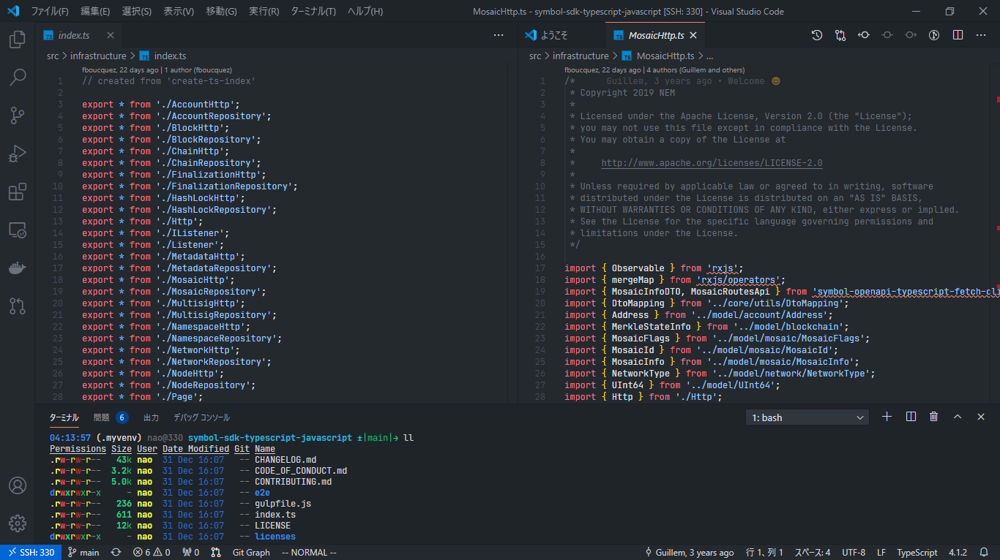
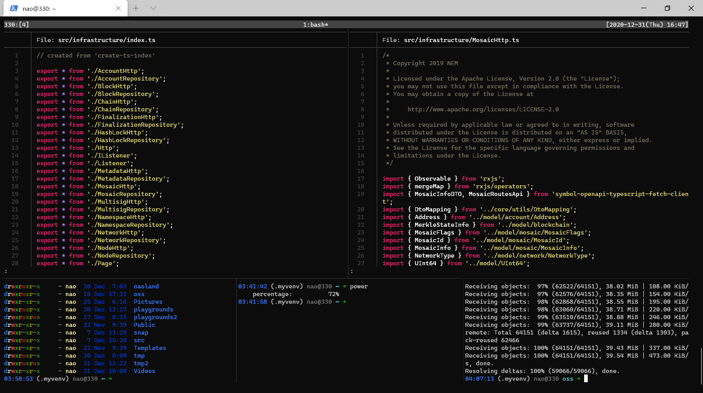

# 私の作業中の画面紹介

nemlog-53828

## Windows 10

### Windows 10 & vscode

### Windows 10 & Tmux & neovim

Windows 10からSSHでUbuntuマシンに接続しています。

 
## Ubuntu

### Ubuntu 20.04LTS & Tmux & neovim

## Links

## 関連情報へのリンク

- [LINE Notify](https://notify-bot.line.me/ja/)
- [私の作業中の画面紹介](https://nemlog.nem.social/blog/53828)（nemlog）
- [nemlog記事とプロフィール](https://nemlog.nem.social/profile/5648)
- [nemlog投稿管理用リポジトリ](https://github.com/naoland/nemlog-posts)
